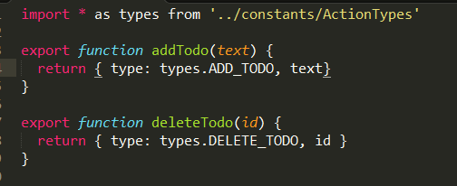
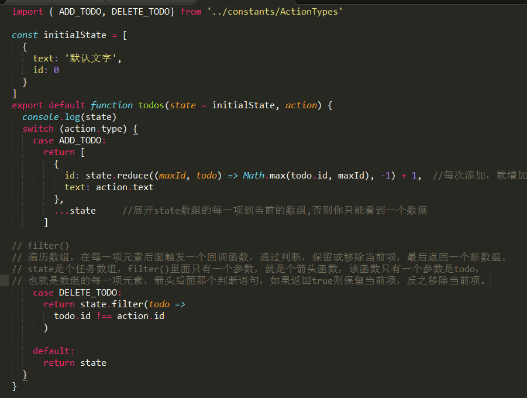
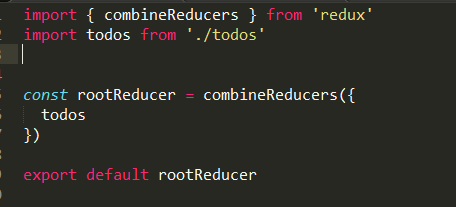

# Redux

## 一、基本概念和 API

### 1. Action 

Action 很简单，就是一个单纯的包含 { type, payload } 的对象，type 是一个常量用来标示动作类型，payload 是这个动作携带的数据。Action 需要通过 store.dispatch() 方法来发送。

```javascript
{
  type: 'ADD_TODO',
  text: 'Build my first Redux app'
}
```

一般来说，会使用函数（**Action Creators**）来生成 action，这样会有更大的灵活性，Action Creators 是一个 pure function，它最后会返回一个 action 对象：


```javascript
function addTodo(text) {
  return {
    type: 'ADD_TODO',
    text
  }
}
```


### 2. Reducer

Reducer 用来处理 Action 触发的对状态树的更改。

官方描述：Action 只是描述了有事情发生了这一事实，并没有指明应用如何更新 state。这是 reducer 要做的事情。
 
这么说吧，Action就像一个指挥者，告诉我们应该做哪些事，比如我要删除，reducer就会给我们提供‘资源（就是上面说的数据）’，真正的体力劳动者是reducer。

也就是说，action里面的每一种描述，比如新增啦，删除一个，删除全部啦，reducer都有一个对应的函数来处理数据。之后返回给你一个新的state


一个 reducer 函数会接受 oldState 和 action 两个参数，返回一个新的 state：(oldState, action) => newState。一个简单的 reducer 可能类似这样：


```javascript
const initialState = {
  a: 'a',
  b: 'b'
};

function someApp(state = initialState, action) {
  switch (action.type) {
    case 'CHANGE_A':
      return { ...state, a: 'Modified a' };
    case 'CHANGE_B':
      return { ...state, b: action.payload };
    default:
      return state
  }
}
```


### 3. Store

Store 就是保存数据的地方，你可以把它看成一个容器。整个应用只能有一个 Store。


前面两个，我们知道使用 action 来描述“发生了什么”，和使用 reducers 来根据 action 更新 state 的用法。 Store 就是把它们联系到一起的对象。

Store 有以下职责：

 - 维持应用的 state；
 - 提供 getState() 方法获取 state；
 - 提供 dispatch(action) 方法更新 state；
 - 通过 subscribe(listener) 注册监听器


创建一个 Store 很容易，将 root reducer 函数传递给 createStore 方法即可：

```javascript
import { createStore } from 'redux';
import someApp from './reducers';
let store = createStore(someApp);

// 你也可以额外指定一个初始 State（initialState），这对于服务端渲染很有用
// let store = createStore(someApp, window.STATE_FROM_SERVER);
```


现在我们就拿到了 store.dispatch，可以用来分发 action 了：

```javascript
let unsubscribe = store.subscribe(() => console.log(store.getState()));

// Dispatch
store.dispatch({ type: 'CHANGE_A' });
store.dispatch({ type: 'CHANGE_B', payload: 'Modified b' });

// Stop listening to state updates
unsubscribe();
```

## 二、Redux流程


首先，用户发出 Action。

```javascript
store.dispatch(action);
```

然后，Store 自动调用 Reducer，并且传入两个参数：当前 State 和收到的 Action。 Reducer 会返回新的 State 。

```javascript
let nextState = todoApp(previousState, action);
```

State 一旦有变化，Store 就会调用监听函数。

```javascript
// 设置监听函数
store.subscribe(listener);
```

listener可以通过store.getState()得到当前状态。如果使用的是 React，这时可以触发重新渲染 View。

```javascript
function listerner() {
  let newState = store.getState();
  component.setState(newState);   
}
```

## 三、 Exapmle

**action**:

action/index.js



创建两个动作，一个新增内容，要给我传回新增的内容，一个是删除文本，给我传回一个id过来


**reducer**: 

reducers/todo.js




reducers/index.js



主要是将多个reducer整合为一个


**store**

store/configureStore.js


